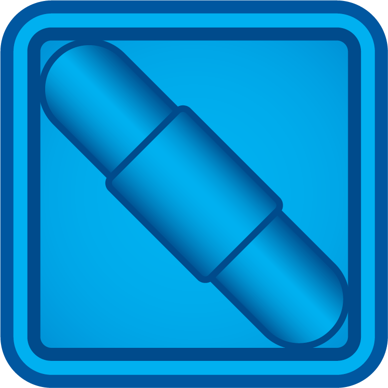

# LaserArena

Desktop application of Thinkfun’s [Lazer Maze™](https://www.thinkfun.com/products/laser-maze/) board game. Game rules can be reached from [here.](https://www.thinkfun.com/wp-content/uploads/2013/09/Laser-1014-Instructions.pdf)

All images, levels, and other relevant game contents are copyrighted by ThinkFun, Inc. This is an open-source implementation of a game that I like to play.

- Sections
    * [Aim of the Game](#aim-of-the-game)
    * [Tokens](#tokens)
    * [How to Play](#how-to-play)
    * [Buttons and Labels](#buttons-and-labels)

## Aim of the Game

Aim of the game is to hit required number of targets with laser beam(s) *using* all the given tokens. A token 
becomes *used* if a laser beam hits or passes through it (there is an exception for *GRAY OBSTACLE*). All tokens 
placed in the *game area*, i.e., 5x5 grid in the middle, and all tokens given in the *waiting list*, i.e., tokens placed above the *game area* should be *used* in order to pass the current level. *Targets left* to pass 
the level will be displayed on the top-right side of the screen in a red or green circle. Initial value of *targets 
left* is set according to the level, and it decreases by one, towards zero, when a new target is hit. Level is 
passed if that number 
turns into a *green zero*, when all the targets hit are *valid* targets and all the given tokens are *used*. Target 
tokens are known as *PURPLE TARGET* and they can be hit from their darker sides. If a *PURPLE TARGET* has a red and 
white target sign, this token must be hit in order to pass the level.

## Tokens

 *RED LASER GENERATOR* is the source of the laser. A laser 
beam is generated in the direction of the white arrow.

 *BLUE MIRROR* reflects the beam by 90 degrees. Note that, 
this mirror can be used as a double-sided mirror by utilizing both of the sides, if needed.

 *YELLOW BRIDGE* lets incoming laser beam pass through 
only from one plane, i.e., only vertically or horizontally. In the given image, only lasers coming from vertically 
(from up-to-down or down-to-top) can be passed, and horizontal beams (from left-to-right or right-to-left) will hit 
the bridge and become stuck.

 *GREEN MIRROR* can be described as a combination of BLUE 
mirror and YELLOW bridge, since it both reflects incoming laser by 90 degrees and also passes the laser through 
itself by 
forming an extra laser beam. With *GREEN MIRROR(s)*, we can form multiple laser beams using only one *RED LASER 
GENERATOR*.

 *GRAY OBSTACLE* is placed on a cell on the grid to 
prevent  player to place a token on that cell. Lasers can pass  through *GRAY OBSTACLE*, if needed. However, *using* 
*GRAY OBSTACLE* is not a must to pass the level, unlike other tokens.

 *PURPLE TARGET* is the most sophisticated token in the 
game. Its dark purple side is known as *target side*, where a laser beam can hit it as a final destination, and decreases the number in *targets 
left* sign by one. Light purple side can be described as a wall, and lasers hit to that side stuck and become 
useless. Diagonal line acts like a *BLUE MIRROR* and reflects the incoming laser by 90 degrees.

## How to Play

Player can change the orientations of the tokens by *LEFT CLICKING* on it, if their orientation is not fixed. If there 
is a question mark in the middle of a token it represents that its orientation is not fixed and can be reorientated.

On the top panel there may be tokens that are waiting to be added to the map. User can add them by *LEFT CLICKING* an 
available waiting token from the top panel and then *LEFT CLICKING* an available cell on the map. Waiting tokens can 
be placed on an empty cell or it can replace another waiting token placed on map. Player can remove placed waiting 
token from a map by *MIDDLE CLICKING*. Pre-placed tokens that are displayed at the beginning of the level or tokens 
placed by Solution or Hint Buttons cannot be moved or removed. 

Required number of targets to be hit can be seen from upper-right corner. Level is finished when it displays 0 and 
turns green. If there are waiting tokens to be placed or all tokens are not passed (except White Obstacle) it will 
not turn to green although all targets are hit. Also, if there are mandatory targets denoted by red and white target 
signs, they must be targeted in order to finish the level.

<!---->

## Buttons and Labels

**|<:** Goes to first level

**<:** Goes to previous level if it exists

**Level X:** Indicates current level and user can RIGHT CLICK to skip to another level or LEFT CLICK to refresh the game into its initial state

**>:** Goes to next level if it exists and it is unlocked. Displays FIN if game is finished.

**>|:** Goes to last unlocked level

**Solution/Game:** Moves between the solution and the game. This button is enabled if the solution of the level is unlocked before.

**Hint:** Gives one hint by correctly placing a token or changing the orientation of it.
